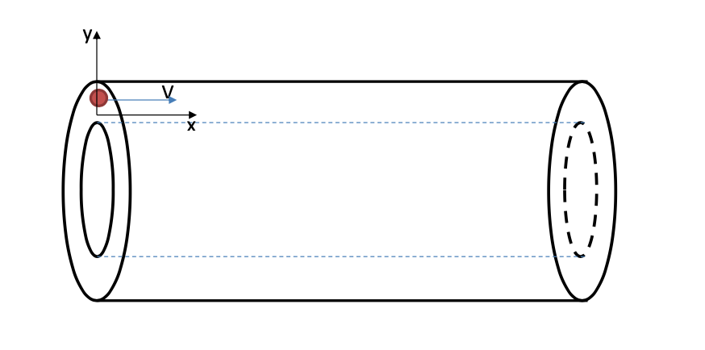

# Particle in a Capacitor model

### Task:
 
An electron enters a cylindrical capacitor with an initial velocity `V`, in the middle between the plates, parallel to the generatrix of the cylinder. What is the minimum potential difference applied to the plates to prevent the electron from leaving the capacitor? Edge effects can be neglected.

Plot the graphs for `y(x)`, `Vy(t)`, `ay(t)`, `y(t)`. The coordinate axes are directed as shown in the figure.
Calculate the flight time t and the final velocity of the electron `V_end`.
Use the data from the table for the dimensions of the capacitor and the electron's velocity. The variant number corresponds to the number in the group list.

### Variant 14

Inner radius `r`, cm = `7.5`

Outer radius `R`, cm = `16`

Initial velocity `V`, m/s = `2*10^6`

Length of the capacitor `L`, cm = `24`